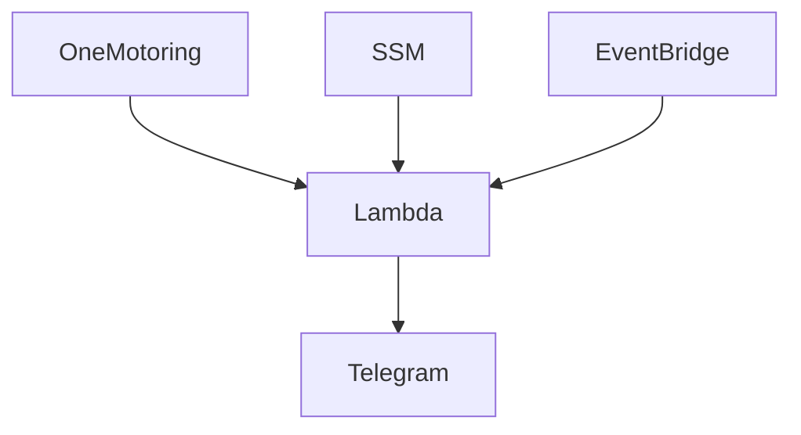

# Scheduled Traffic Alert to Telegram channel
[Telegram Channel](https://t.me/TrafficAlertSG)

[Website](https://onemotoring.lta.gov.sg/content/onemotoring/home/driving/traffic_information/traffic_updates_and_road_closures.html#traffic-updates)

## Description 

The application performs traffic alert to desired Telegram channel every minute. 

### Aspect 
- Monitoring
- Change Detection
- Alert
  
### Technologies

Python 3.7 and AWS serverless services.

### Cloud Architect (trying out Mermaid heh)



### Python Packages
`pip install -r requirements.txt --target . --no-user`

1. Create `lambda_function.py`

2. Zip the files to `lambda_function.zip` for uploading to AWS Lambda later on
   
### AWS Lambda

1. Create AWS Lambda `sgroadalert`

2. Upload `lambda_function.zip`

3. Add Execution role `AmazonSSMReadOnlyAccess`

4. Increase timeout
   
6. Create Environment
   - `description : any`
   - `timestamp : any`
   - `emoji : any`

#### Costing
- Duration (Average): 3500.00 ms
- Memory Size: 128 MB
- Triggers every minute
  
**We are still within free tier!**
  
[AWS Calculator](https://calculator.aws/#/addService/Lambda)
```
Unit conversions
Number of requests: 1 per minute * (60 minutes in an hour x 730 hours in a month) = 43800 per month
Amount of memory allocated: 128 MB x 0.0009765625 GB in a MB = 0.125 GB
Amount of ephemeral storage allocated: 512 MB x 0.0009765625 GB in a MB = 0.5 GB

Pricing calculations
43,800 requests x 3,500 ms x 0.001 ms to sec conversion factor = 153,300.00 total compute (seconds)
0.125 GB x 153,300.00 seconds = 19,162.50 total compute (GB-s)
19,162.50 GB-s - 400000 free tier GB-s = -380,837.50 GB-s
Max (-380837.50 GB-s, 0 ) = 0.00 total billable GB-s
Tiered price for: 0.00 GB-s
Total tier cost = 0.0000 USD (monthly compute charges)
43,800 requests - 1000000 free tier requests = -956,200 monthly billable requests
Max (-956200 monthly billable requests, 0 ) = 0.00 total monthly billable requests
0.50 GB - 0.5 GB (no additional charge) = 0.00 GB billable ephemeral storage per function

Lambda costs - With Free Tier (monthly): 0.00 USD
```

### AWS EventBridge Trigger

1. Set `cron(*/1 * * * ? *)` for every minute.

### AWS Systems Manager
For Telegram Bot Token and Telegram Chat ID
